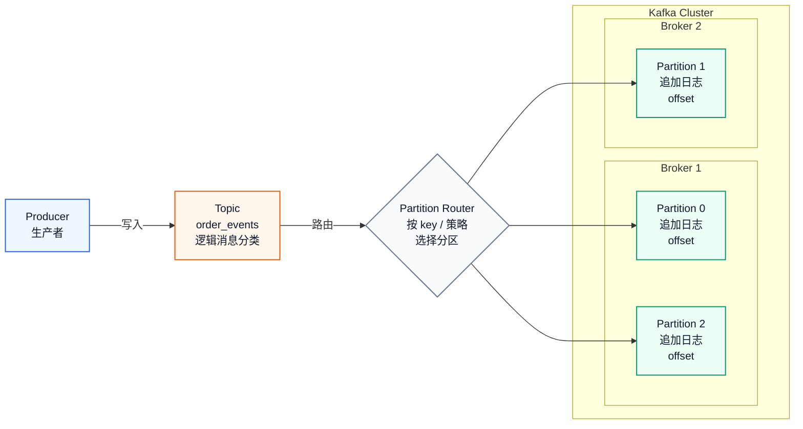
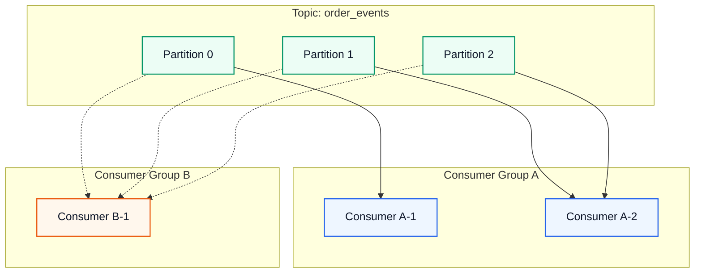

资料来源

- 小林
- gpt

- <<深入理解 kafka>>

---

# 消息队列101

功能

- 异步：解耦服务依赖。例子：发短信/ 用餐后写评价
- 削峰：解决瞬时流量过高，单一服务可能扛不住的场景。例子：抢票
- 分发：多服务依赖同一状态变化，由上游通知下游变成下游订阅上游。例子：下单

# Kafka

架构

- 生产者：producer
- 服务节点：broker
  - 主题：topic【逻辑概念】
  - 分区：partition【物理实现】
- 消费者：consumer
  - 消费者组：逻辑概念

关系图：producer、broker、topic、partition

记忆方式：

- producer 面向 topic 发消息，不需要直接关心消息最终落在哪台 broker 上
- topic 是逻辑名，用来表达一类消息，比如订单事件、支付事件
- partition 是 topic 的物理拆分，每个 partition 都是一份可追加的日志文件
- broker 是服务节点，真正存放 partition 数据；一个 topic 的多个 partition 可以分布在多个 broker 上

架构理解

- broker 是一个独立服务端进程，topic 是逻辑概念，一个 broker 可以有多个 partition
- partition 是物理实现，通过 offset 来唯一定位消息，是个可追加的日志文件
- topic 是逻辑概念：topic 可以包括多个 broker 的多个分区

功能理解

- 通过 partition：实现 topic 的水平扩展【同一个消费者组内，一个 partition 同一时刻只会分配给一个 consumer；一个 consumer 可以消费多个 partition】

- 消费者组：引入消费者组，可以扩展消费能力，而不用自定义代码逻辑

关系图：consumer、consumer group

消费者组记忆方式：

- 图里的实线表示 Consumer Group A 内部的分摊消费；虚线表示 Consumer Group B 独立消费同一批 partition
- 同一个 consumer group 内：多个 consumer 是合作关系，大家一起分摊 topic 的 partition
- 同一个 consumer group 内：一个 partition 同一时刻只会被一个 consumer 消费，避免同组重复消费
- 一个 consumer 可以消费多个 partition；如果 consumer 数量超过 partition 数量，多出来的 consumer 会空闲
- 不同 consumer group 彼此独立，各自维护 offset；同一条消息可以被不同 group 都消费一次

# 系统设计

延时队列

死信队列

优先级队列

> 这几个在 rocketmq 都支持，但是 kafka 不支持，所以要大概了解下设计思路和实现

延时队列

- 设计思路：先把延时消息放到一个地方，然后启动服务轮询，如果符合要求，再放到对应消费的 mq 里面供销费
  - 延时消息放到 redis/mysql 中 【设计好数据库表 timestamp, biz_id, msg_content, key, status..】
  - 启动服务进行轮询：定期轮询 mysql/redis 扫 status =0  & timestamp < 当前时间的 把这些记录拿出来
  - 找到合适的记录，拼接成 msg 放到 mq 中
- 拓展
  - 消息存储时间分长短：时间轮 & db/reids
  - db 设计

优先级队列

- 设计思路：分成 2-3 个队列拆解，不同的队列就是不同的优先级，然后让消费者去不同的队列里面拿任务
  - 分成多个 mq：1st_mq, 2nd_mq, 3rd_mq
  - 不同的消费者/消费者组 去不同的 mq 里面拿消息消费
- 拓展
  - 权重思路：防止有些消费者一直拉不到消息，比如可以按权重加权，确保低优先级的最好也能被消费到

死信队列：异常情况的队列【生产端/消费端】

- 设计思路：设计一个 topic，然后让业务端异常的时候把 message 放到一个特殊的队列中
- 拓展
  - message 设计：retry_cnt，fail_reason, 错误堆栈信息等等
