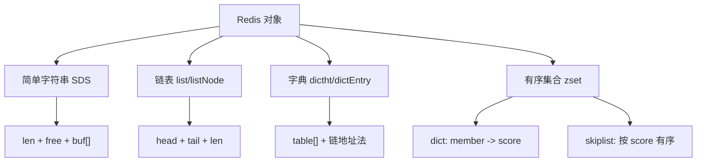
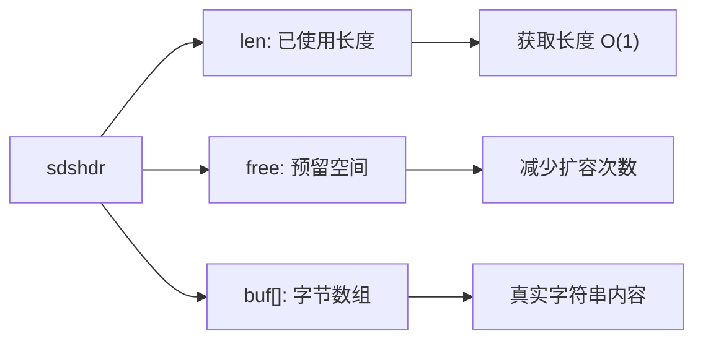
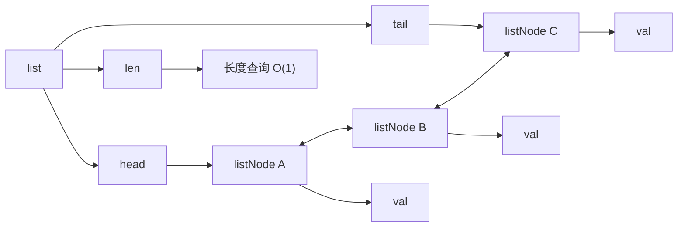
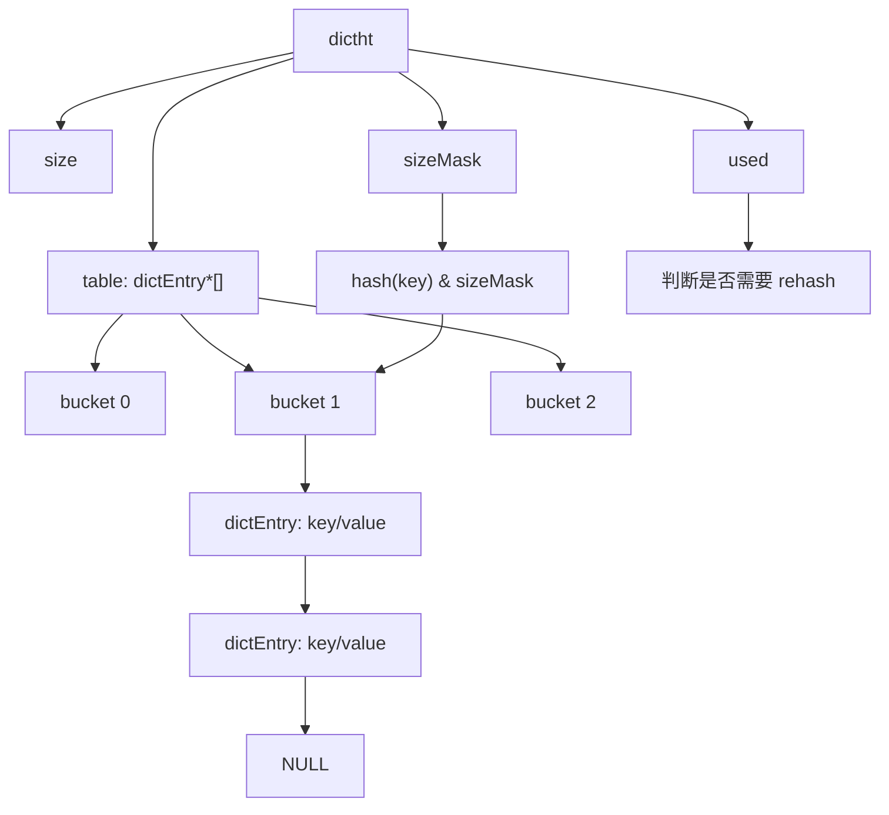
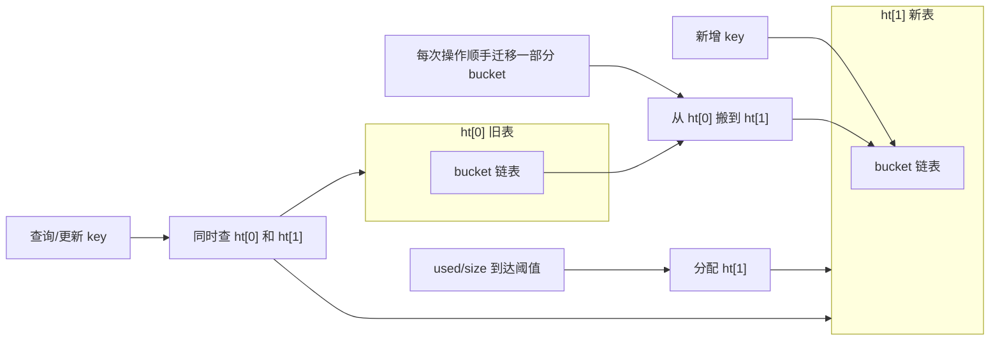
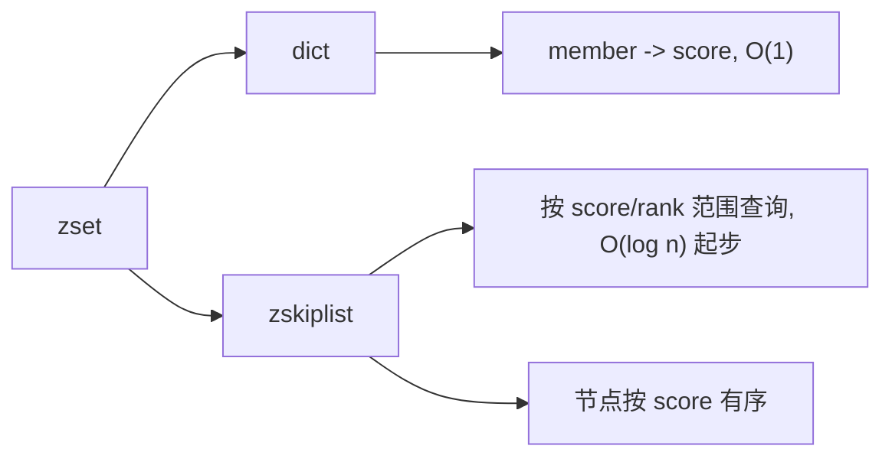
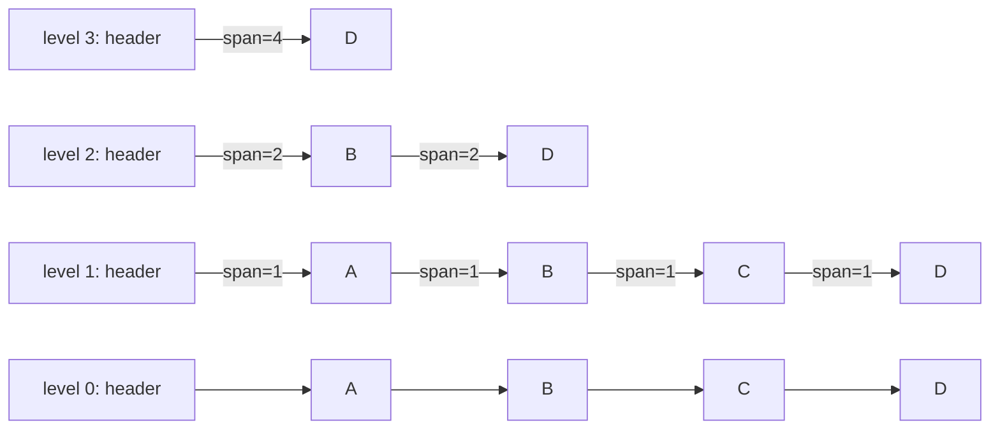

面试复习：Redis 对象底层实现原理

内容

- 简单字符串：sds
- 链表：listNode
- 哈希：hash
- 跳表：skiplist

结构总览：




# sds


数据结构

```c
typedef struct sdshdr {
  int len;
  int free;
  char buff[]
}
```




好处

- 获取字符串长度是 `O(1)` 的，默认字符串长度c 语言函数没有内置，只能获取
- 避免重复分配内存：预留空间，避免多次执行分配内存的系统调用


# 链表


```c
typedef struct listNode {
  struct listNode *prev;
  struct listNode *next;
  void * val;
}
```


```c
typedef struct list {
  listNode * head;
  listNode * tail;
  unsigned long len;
}
```




特点：

- 获取链表长度是 `O(1)`


# 字典

用一个数组配合链表来实现

```c
typedef struct dictht {
  dicEntry ** table;
  unsigned long size; // 大小, 用来计算表格大小
  unsigned long sizeMask; // 掩码 用来计算哈希位置
  unsigned long used;  // 计算使用的, 结合 used & size 来计算 是否需要 rehash
}
```


```c
// 字典的每个值的带下
typedef struct dictEntry {
	void * key; // 键
  val union { // 值是枚举类型, 可以是指针 也可以是整数
    void * val;
    uint64_tu64; // 有可能有错
    int64_ts64;
  }
  struct dictEntry * next
}
```






- 插入重复值：基于链表实现，因为没办法获取尾部节点，所以每次插入的值，会优先放到最前面
- rehash
  - 时机：
    - 服务器没有启动额外子进程【没有备份】， used >= size
    - 服务器启动了 额外子进程 ： used / size >= 配置的值，一般是 5
  - 动作：渐进式 rehash
    - 分配一个 `ht[1]` ：size 是 2 的 n 次方幂 >= used `*` 2
    - 新增写入：只会写入新的哈希数组
    - 存量写入：更新旧表，也会更新新表


# 跳表


```c
typedef struct zset {
	dict *dict;
  zskiplist *zsl;
} zset
```


```c
typedef struct zskiplistNode {
    robj *obj;
    double score;
    struct zskiplistNode *backward;
    struct zskiplistLevel {
        struct zskiplistNode *forward;
        unsigned int span;
    } level[];
} zskiplistNode;
```




能力：dict 负责根据 member 找 score  `O(1)`，zsl 根据 score 来批量查询/更新 member `o(log n)`





QA

- 层高如何确定：随机确定的，25% 的概率，大概率是底层，最高 32 层，越往上概率越小
- 如何保持平衡：通过随机层高来保持平衡
- span 跨度来计算排名：快速获取 rank
